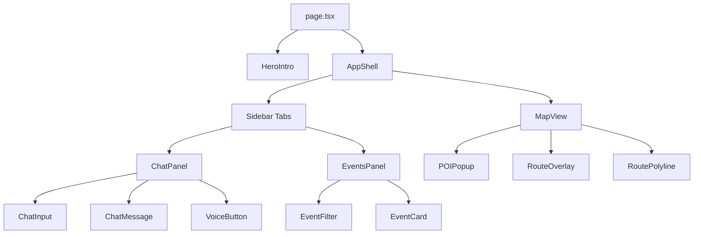
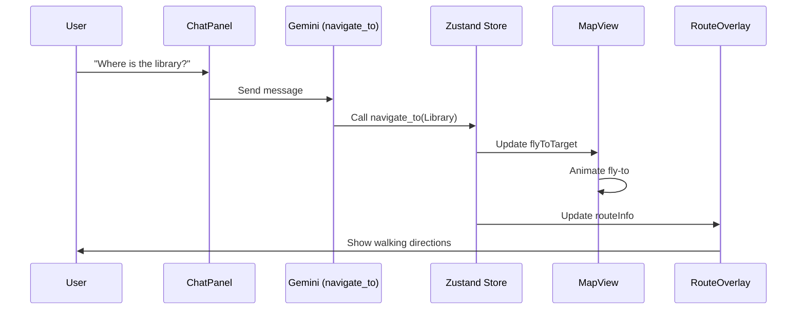
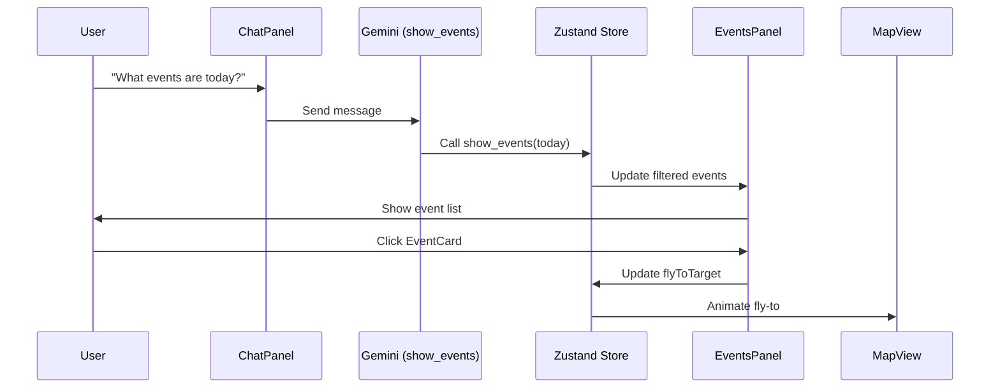
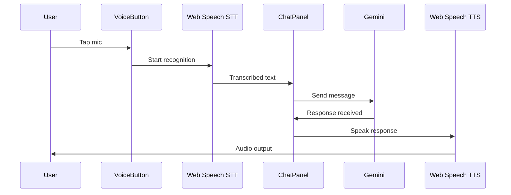
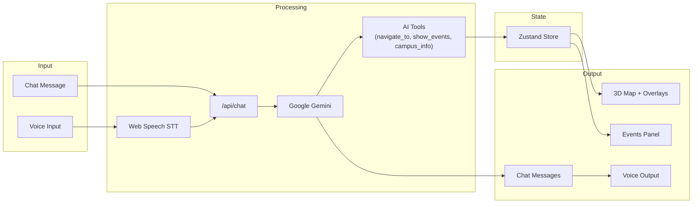
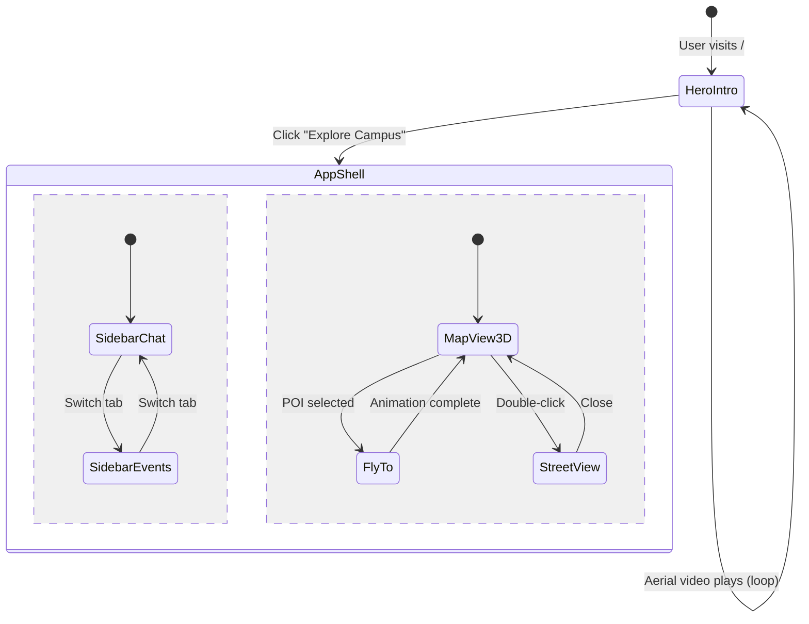
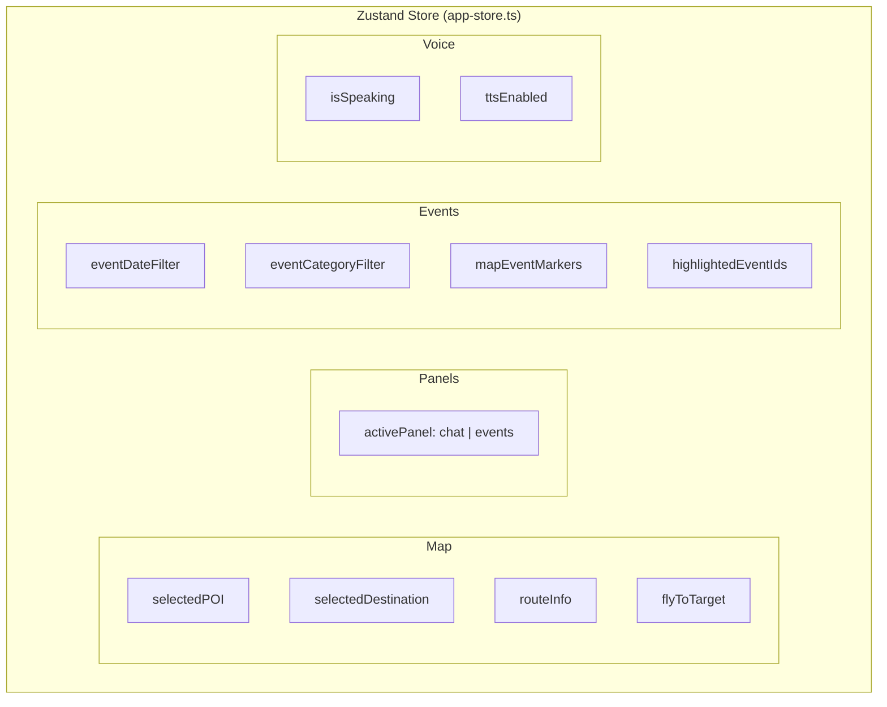

# AskSUSSi -- Campus Intelligent Assistant

AI-powered campus assistant for the Singapore University of Social Sciences. Chat with AskSUSSi to navigate a 3D campus map, discover events, find nearby food and amenities, and get voice-guided directions.

## Tech Stack

| Layer | Technology |
|---|---|
| **Framework** | Next.js 16 (App Router) |
| **Language** | TypeScript 5 |
| **UI** | React 19, Tailwind CSS 4 (OKLCH tokens), shadcn/ui (Base-UI primitives) |
| **AI** | Vercel AI SDK + Google Gemini (`gemini-3.1-flash-lite-preview`) |
| **Maps** | Google Maps 3D API (`@vis.gl/react-google-maps`) |
| **State** | Zustand 5 |
| **Voice** | Web Speech API (recognition + synthesis, `en-SG`) |
| **Fonts** | Nunito Sans (primary), Source Code Pro (mono) |
| **CI/CD** | GitHub Actions (lint + build) + Railway (auto-deploy) |

## Architecture

### System Overview

```mermaid
graph TD
    subgraph Frontend
        UI[React Components]
        Store[Zustand Store]
        Voice[Web Speech API]
    end
    subgraph Backend
        API_Chat[/api/chat]
        API_Events[/api/events]
    end
    subgraph External
        Gemini[Google Gemini]
        Maps[Google Maps 3D]
        Routes[Google Routes API]
        Solar[Google Solar API]
    end

    UI --> Store
    UI --> API_Chat
    UI --> API_Events
    API_Chat --> Gemini
    Store --> Maps
    Store --> Routes
    Store --> Solar
    Voice --> UI
```

### Component Hierarchy



### Project Structure

```text
src/
├── app/
│   ├── api/
│   │   ├── chat/route.ts             # AI chat streaming endpoint (Gemini)
│   │   └── events/route.ts           # Campus events API
│   ├── globals.css                    # SUSS-branded design tokens (OKLCH)
│   ├── layout.tsx                     # Root layout + fonts
│   └── page.tsx                       # Entry point -> HeroIntro -> AppShell
│
├── components/
│   ├── chat/
│   │   ├── ChatInput.tsx              # Text input + send button
│   │   ├── ChatMessage.tsx            # User/assistant message bubbles
│   │   ├── ChatPanel.tsx              # Main chat interface with tool call handling
│   │   ├── ChatSkeleton.tsx           # Loading skeleton for chat
│   │   └── VoiceButton.tsx            # Mic toggle (Web Speech API)
│   ├── events/
│   │   ├── EventCard.tsx              # Event card with map fly-to
│   │   ├── EventCardSkeleton.tsx      # Loading skeleton for events
│   │   ├── EventFilter.tsx            # Date range preset filter (Today/3d/7d/All)
│   │   └── EventsPanel.tsx            # Filterable events list
│   ├── layout/
│   │   ├── AppShell.tsx               # Split-pane layout (sidebar + map)
│   │   └── HeroIntro.tsx              # Landing page with aerial video
│   ├── map/
│   │   ├── AerialViewButton.tsx       # Aerial flyover toggle
│   │   ├── MapView.tsx                # Google Maps 3D via @vis.gl/react-google-maps
│   │   ├── POIPopup.tsx               # Point of interest info popup
│   │   ├── RouteOverlay.tsx           # Walking route info card
│   │   ├── RoutePolyline.tsx          # 3D polyline for walking route
│   │   └── StreetViewPanel.tsx        # Street view panel
│   └── ui/                            # shadcn/ui primitives (button, card, tabs, etc.)
│
├── hooks/
│   └── useCampusEvents.ts             # Event fetching & filtering hook
│
├── lib/
│   ├── ai/
│   │   ├── provider.ts                # Google Generative AI setup
│   │   ├── system-prompt.ts           # AskSUSSi personality + campus context
│   │   └── tools.ts                   # AI tools: navigate_to, show_events, campus_info
│   ├── maps/
│   │   ├── aerial-view.ts             # Aerial View API integration
│   │   ├── campus-pois.ts             # 37 POIs (campus + nearby venues)
│   │   ├── route-utils.ts             # Google Routes API + polyline decoder
│   │   └── solar-utils.ts             # Solar API for sun exposure data
│   ├── voice/
│   │   ├── speech-recognition.ts      # STT wrapper
│   │   └── speech-synthesis.ts        # TTS wrapper
│   ├── date-utils.ts                  # Date range preset utilities
│   └── utils.ts                       # General utilities (cn helper)
│
├── store/
│   └── app-store.ts                   # Zustand global state (map, events, voice)
│
└── types/
    └── index.ts                       # POI, CampusEvent, RouteInfo, DateRangePreset
```

## User Flows

### Chat Navigation



### Event Discovery



### Voice Interaction



### Data Flow



### Landing to App Transition



## AI Tools

The assistant uses three primary tools to interact with the campus environment:

1. **navigate_to**: Finds a destination by name, updates the map with a fly-to animation, and displays walking directions.
2. **show_events**: Filters campus events by date, category, or school using presets like today, 3 days, or 7 days.
3. **campus_info**: Answers general questions about the campus and provides details on nearby venues, including ratings and hours.

## Constitution and Design Principles

The project follows five core principles that govern all development decisions:

### Core Principles

| Principle | Rule |
|---|---|
| **I. Declarative React** | All UI uses React's declarative component model. Imperative DOM manipulation is forbidden except in isolated wrappers for web components without React bindings. Prefer React bindings (`@vis.gl/react-google-maps`) over raw web components. |
| **II. Type Safety** | TypeScript strict mode. No `as any`, `@ts-ignore`, or `@ts-expect-error`. Every prop, hook return, and API response has explicit interfaces in `src/types/index.ts`. |
| **III. Component Isolation** | Single responsibility per component. Map rendering, street view, route overlay, and aerial view are separate components. Hooks encapsulate reusable logic. Dead code is removed before merge. |
| **IV. API Key Security** | Keys via `process.env.NEXT_PUBLIC_*` only, never committed. Graceful degradation with fallback UI when keys are missing. `.env.local` is gitignored. |
| **V. UX First** | Landing page loads within 3 seconds. Smooth animated transitions between views. Loading states are always visible. SUSS brand identity (`#003B5C` primary, Nunito Sans) applied consistently. |

### Technology Constraints

- **Styling**: Tailwind CSS 4 with OKLCH color tokens in `globals.css`. No inline style objects except for dynamic values.
- **State**: Zustand 5 as the single global store at `src/store/app-store.ts`. No prop drilling beyond one level.
- **Maps**: `APIProvider` wraps the map tree. Raw `gmp-*` web components only for elements without React bindings (e.g. `gmp-polyline-3d`).
- **Icons**: Inline SVG or Lucide React. No icon font libraries.

### Store Shape



### Development Workflow

- **Branching**: Feature branches from `main`. Git worktrees for parallel development.
- **Commits**: Conventional commits (`feat:`, `fix:`, `docs:`, `refactor:`, `ci:`).
- **Pre-merge gates**: ESLint clean, `next build` succeeds with zero errors.
- **Dead code policy**: Unused components, hooks, or utilities must be removed before merge.

## POIs & Venues

The app tracks 37 locations across several categories:

| Category | Count | Examples |
|---|---|---|
| On-campus | 10 | Library, Lecture Halls, Admin, Sports Complex |
| Supermarket | 5 | FairPrice Finest, FairPrice 24hr, U Stars |
| Restaurant | 4 | Foodclique (campus), HoHo Korean, Sukiya |
| Mall | 5 | Clementi Arcade, Clementi Mall, West Coast Plaza |
| Bar | 4 | Get Some, Berlin Bar, Le White Bar |
| Hawker | 7 | Hawkers' Street, 448 Market, Ayer Rajah |

## Getting Started

### Installation

```bash
npm install
```

### Environment Variables

Create a `.env.local` file in the root directory and add the following keys:

| Variable | Required | Description |
|---|---|---|
| `GOOGLE_GENERATIVE_AI_API_KEY` | Yes | Gemini API key for chat |
| `NEXT_PUBLIC_GOOGLE_MAPS_API_KEY` | Yes | Browser Maps API key for Maps 3D and client-side map features |
| `GOOGLE_MAPS_API_KEY` | Yes | Server-side Google Routes API key used by `/api/route` |

### Development

```bash
npm run dev
```

Open [http://localhost:3000](http://localhost:3000) to view the application.

## CI/CD

- **Pull Requests**: GitHub Actions runs linting and build checks on all PRs to the main branch.
- **Deployment**: Merges to the main branch trigger an automatic deployment to Railway.

## Contributing

All contributions must comply with the project constitution (see above). In particular:

1. Use conventional commit messages (`feat:`, `fix:`, `docs:`, etc.)
2. Ensure `npm run lint` and `npm run build` pass with zero errors
3. No type suppressions (`as any`, `@ts-ignore`)
4. Remove dead code before opening a PR
5. New components must follow the single-responsibility principle

The full constitution is maintained at `.specify/memory/constitution.md`.
